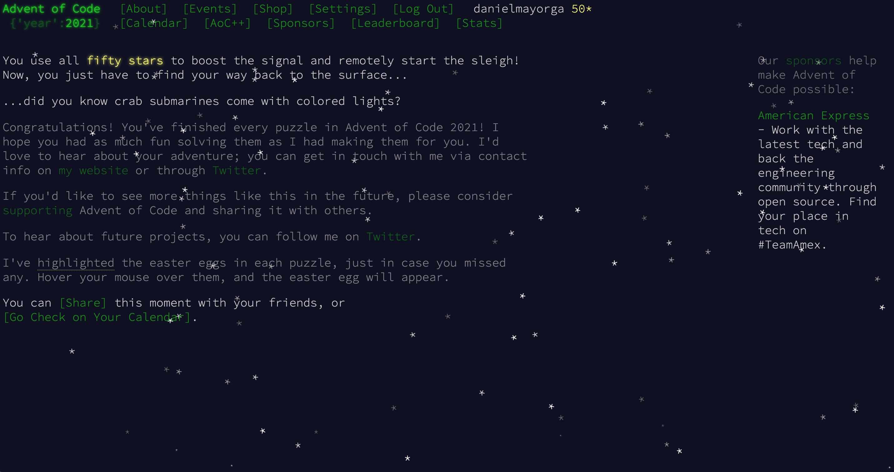

# Advent of Code 2021 in Typescript with Node

Node 16.3 >= is required to build the project.
Text files exists for most problems some with simple inputs are just inserted manually.

## How to run

2021 can be built with 
- `npm install`
- `npm run build`
- `node ./out/dayXX.js` replace XX with day you want to run

file path references assume you are running at project root, some days have the input written in, so feel free to modify for research purposes. 

## The code should work, or at least it works on my machine :P

## Notes 

I may alter this project to add a GUI in the future and may support other file outputs, but in the meantime I'll probably watch TV or work on other years problem. 

## Old Years
I did 2017 in it's entirety in C#, in 2017 but can't find any of the C# files since my Macbook lost all my data in 2020 due to a corrupt OS update :(, so no files for older years. 

I've only done the first 13 days of `2018` and `2019` and also don't have the code for it due to the issue above. Now, I revisited 2019 day 14 to do old problems. Check it out [day14](./2019/day14/). I like my small editorial